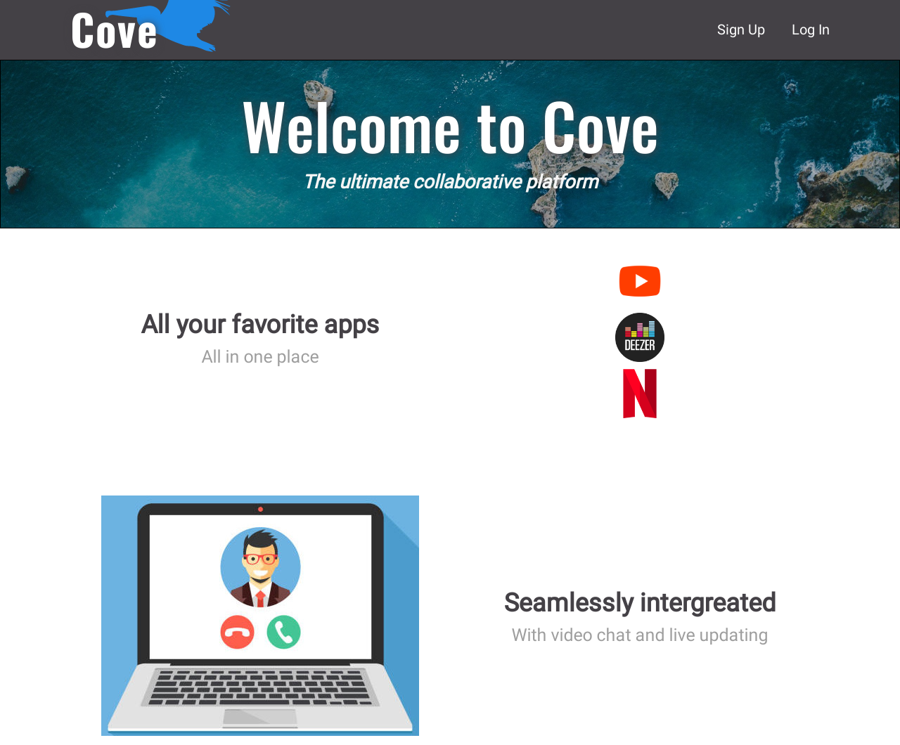
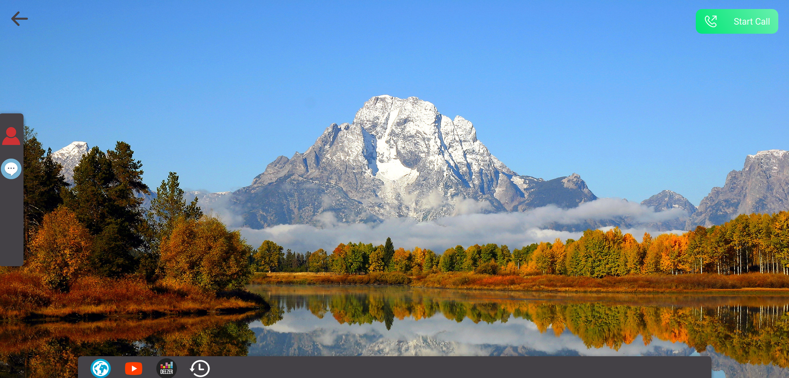
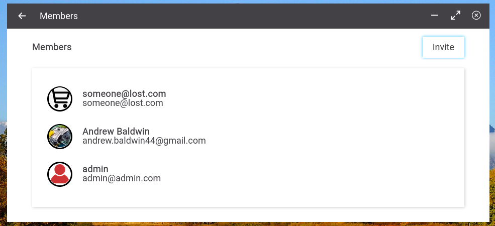

# Cove
> Collaborative Platform Made for Concordia University

<div align='center'>  
  
</div>

## Demo

[View the Live Demo](https://andrewbaldwin-cove.herokuapp.com/)

## About

Cove is a collaborative platform made to improve the experience of interacting online. Users can create and host virtual rooms in which they can collaborate with their friends, peers, or classmates. The rooms contain video calling and a variety of different applications. All actions in the rooms are synchronized between peers.

## Features

**_Create and Personalize an account_**

<br>

**_Create Your Cove_**

<div align='center'>
  
  
</div><br><br>

**_Hop in a Video Call or Use the Live Chat_**

<div align='center'>
  
</div><br><br>

**_Make Your Cove Your Own!_**

<div align='center'>
  
  
</div><br><br>

**_Collaborate Together on Your Favourite Apps!_**

<div align='center'>
  
  
  
  <br><br>
  
</div><br><br>


**_Pin Widgets to the Desktop_**

<div align='center'>
  
  
</div><br><br>

**_Invite All Your Friends!_**

<div align='center'>
  
  
</div><br>

### Deploy the Project

**Clone the repo to your local machine using the terminal**:

```
$ git clone git@github.com:andrewbaldwin44/Cove.git
```

**Install the Dependencies**:

1. Navigate into the server directory `cd server`
2. Install the required server packages `yarn install`
3. Start the back-end server `yarn start`
4. Navigate into the client directory `cd client`
5. Install the required client packages `yarn install`
6. Start the front-end server `yarn start`

This will run the app in the development mode.<br />
Open [http://localhost:3000](http://localhost:3000) to view it in the browser.

The page will reload if you make edits.

**The Server**

A folder is provided, `/server`, with the back-end code. This is a local server that you will connect to to retrieve/write the data.

### Technologies Used

**Frontend**:

- JavaScript
- React.js
- Redux.js

**Backend**:

- Node.js
- Express
- Socket.io
- WebRTC,
- Firebase Authentication,
- Cloud Firestore Realtime Database

### Author

👤 **Andrew Baldwin**

- Github: [@andrewbaldwin44](https://github.com/andrewbaldwin44)
